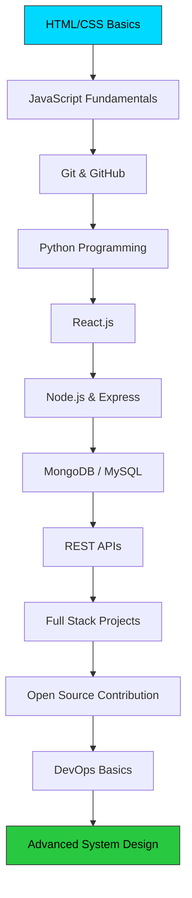
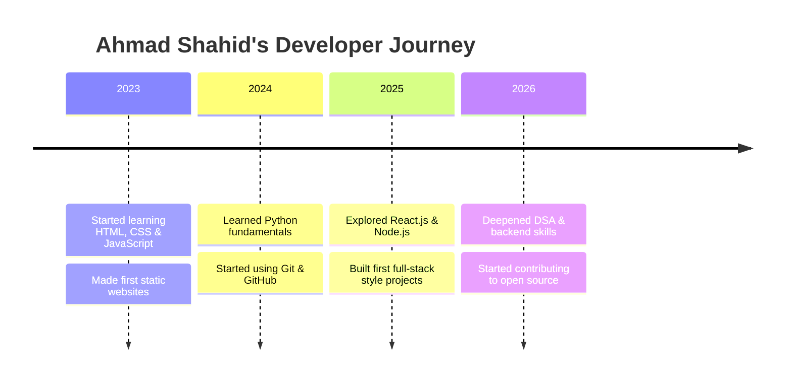

<!-- =============================================
     AHMAD SHAHID - GITHUB PROFILE README
     Enhanced with graphs, badges, buttons & video
     ============================================= -->

<div align="center">

<!-- Header -->


<!-- Badges Row -->
<p>
  
  
  
  
  
</p>

<!-- Typing Animation -->
<p></p>

<!-- Profile Views + Widget Row -->
<p>
  
  
  
</p>


</div>

<a name="toc"></a>
<!-- TABLE OF CONTENTS -->
<details>
<summary><b>📑 Table of Contents (click to expand)</b></summary>
<br/>

- [👋 About Me](#about-me)
- [🕐 Now / Fun Facts / Currently Reading](#about-me)
- [💬 Random Dev Quote](#quote)
- [📊 Quick Stats](#quick-stats)
- [🤝 Connect With Me](#connect)
- [🧰 Tech Stack & Tools](#tech-stack)
- [📈 GitHub Profile Stats](#gh-stats)
- [🎲 3D Contribution Graph](#3d-contrib)
- [💻 Coding Profile Stats](#coding-stats)
- [🏅 GitHub Achievements](#achievements)
- [🔥 Activity & Contributions](#activity)
- [🏆 Trophy Gallery / WakaTime / Community / Sponsors](#activity)
- [🧩 Skills Breakdown](#skills-breakdown)
- [🗺️ Learning Roadmap](#roadmap)
- [🎓 Certifications & Courses](#certs)
- [👋 Hello in Many Languages](#hello)
- [🖥️ My Dev Environment](#dev-env)
- [🖼️ Project Screenshots](#gallery)
- [🏆 Awards & Recognition](#awards)
- [🎯 2026 Goals](#goals)
- [🤝 Open to Mentorship](#mentorship)
- [🐍 Code Philosophy](#snippet)
- [🎯 Interests & Hobbies](#interests)
- [🚀 Featured Projects](#projects)
- [🏷️ Full Badge Wall](#badge-wall)
- [❓ FAQ](#faq)
- [💌 Testimonials](#testimonials)
- [📋 Repository Overview](#repo-overview)
- [⭐ Star History](#star-history)
- [📅 Contribution Calendar (More Themes)](#calendar-themes)
- [🤖 How I Use AI in My Workflow](#ai-workflow)
- [📢 Announcements](#announcements)
- [📰 Latest Blog Posts](#blog)
- [🗺️ Visitor Map](#visitor-map)
- [📌 Important Notes](#notes)
- [💖 Support & Appreciation](#support)
- [🎬 My Video](#video)
- [🗓️ My Dev Journey](#journey)
- [🧠 Problem Solving Stats](#problem-solving)
- [📊 Extended GitHub Metrics](#metrics)
- [🛠️ Tools I Recommend](#tools-recommend)
- [💬 Guestbook](#guestbook)
- [📜 Changelog](#changelog)
- [📄 License](#license)
- [👋 Footer / Contact](#footer)

</details>

---


---

<a name="about-me"></a>
<!-- ABOUT ME -->
<h2 align="center"> About Me</h2>

<table border="0">
<tr>
<td width="55%">

```go
package main

import "fmt"

type Developer struct {
    Name       string
    Username   string
    Location   string
    Country    string
    Role       string
    Focus      string
    Status     string
    Experience []string
    Hobbies    []string
}

func main() {
    me := Developer{
        Name:       "Ahmad Shahid",
        Username:   "Ahmadansari1942",
        Location:   "Multan",
        Country:    "Pakistan 🇵🇰",
        Role:       "Student + Web Developer",
        Focus:      "Web Dev & Python",
        Status:     "🟢 Open to Collaborate",
        Experience: []string{
            "Web Development",
            "Python Programming",
            "Git & GitHub",
            "Open Source",
            "HTML/CSS/JS",
            "React",
        },
        Hobbies: []string{
            "📚 Reading Books",
            "📖 Reading Docs",
            "💻 Coding",
            "🔨 Building Projects",
            "🌐 Open Source",
        },
    }
    fmt.Println("Welcome! I'm", me.Name)
    fmt.Println("Focus:", me.Focus)
    fmt.Println("Status:", me.Status)
}
```

</td>
<td width="45%">

</td>
</tr>
</table>

<div align="center">

> 💡 **I'm a passionate student developer** from Multan, Pakistan 🇵🇰 — building amazing web apps, exploring Python, and contributing to open source. Let's connect and create something incredible together!

<br/>

### 🕐 Now

<div align="center">

| | |
|---|---|
| 🏙️ **Based in** | Multan, Punjab, Pakistan 🇵🇰 |
| 🎓 **Currently** | Studying + building web projects |
| 🌱 **Learning** | React.js, Node.js & Data Structures |
| 🤝 **Looking to collaborate on** | Open source web & Python projects |
| 🗣️ **Ask me about** | HTML, CSS, JavaScript, Python, Git |
| ⚡ **Fun fact** | I debug faster with chai in hand ☕ |

</div>

<br/>

### 🎯 Fun Facts

<div align="center">

| # | Fun Fact |
|:---:|:---|
| 1 | ☕ Chai without code review doesn't count as a break |
| 2 | 🌙 Best code ideas come at night |
| 3 | 📖 I read documentation for fun, not just when stuck |
| 4 | 🐍 First language I learned was Python |
| 5 | 🔁 I rewrite old projects when I learn something new |
| 6 | 🎧 Music helps me focus while coding |
| 7 | 🧩 I enjoy solving small automation problems |
| 8 | 🗂️ I keep notes on everything I learn |

</div>

<br/>

### 📚 Currently Reading / Studying

<div align="center">

| Resource | Type | Status |
|:---|:---:|:---:|
| Eloquent JavaScript | Book | 🟡 In Progress |
| Python Crash Course | Book | ✅ Completed |
| MDN Web Docs | Documentation | 🔄 Ongoing |
| freeCodeCamp Curriculum | Course | 🟡 In Progress |

</div>

<br/>

### 🏢 Organizations

<div align="center">

<sub>Filhaal kisi organization ka member nahi hoon — jaise hi kisi open-source org ya team se juduga, yahan badge add ho jayega.</sub>

</div>

</div>

---


---

<a name="quote"></a>
<!-- RANDOM DEV QUOTE (auto-changes every time profile is viewed) -->
<div align="center">

</div>

---


---

<a name="quick-stats"></a>
<!-- QUICK STATS -->
<h2 align="center"> Quick Stats</h2>

<div align="center">

| 📊 Metric | ✨ Value |
|:---:|:---:|
| 📍 Location | Multan, Pakistan 🇵🇰 |
| 👨‍💻 Role | Student + Web Developer |
| 🎯 Focus | Web Development & Python |
| 📚 Status | 🟢 Open to Learn & Collaborate |
| 🌱 Currently Learning | Advanced Web Development |
| ⚡ Fun Fact | I love reading docs & building projects! |
| 🔥 Passion | Open Source & Innovation |
| 🎮 Hobbies | Coding, Reading, Building |
| 🗓️ Coding Since | 2023 |
| 🧭 Timezone | PKT (UTC+5) |
| 🖥️ Primary OS | Windows / Linux |
| 📱 Reachable On | Telegram, Gmail |
| 🧑‍🎓 Education | Currently a student |
| 🎯 Short-term Goal | Land first internship/freelance gig |
| 🚀 Long-term Goal | Become a full-stack developer |

</div>

<div align="center">

<!-- Skill Level Badges -->
<p>
  
  
  
  
  
</p>

</div>

---


---

<a name="connect"></a>
<!-- CONNECT WITH ME -->
<h2 align="center"> Connect With Me</h2>

<div align="center">

<!-- Main Social Buttons -->
<p>
  <a href="https://t.me/Ahmadansari191" target="_blank">
    
  </a>
  <a href="mailto:ahmadshahid.dev@gmail.com" target="_blank">
    
  </a>
  <a href="https://instagram.com/ahmadansari7805" target="_blank">
    
  </a>
  <a href="https://www.facebook.com/Ahmadansari19" target="_blank">
    
  </a>
  <a href="https://github.com/Ahmadansari1942" target="_blank">
    
  </a>
</p>

<!-- Secondary Buttons -->
<p>
  <a href="https://github.com/Ahmadansari1942?tab=repositories" target="_blank">
    
  </a>
  <a href="https://github.com/Ahmadansari1942?tab=stars" target="_blank">
    
  </a>
  <a href="https://github.com/Ahmadansari1942?tab=followers" target="_blank">
    
  </a>
  <a href="https://github.com/Ahmadansari1942?tab=following" target="_blank">
    
  </a>
</p>

<p><b>📱 Let's connect on any platform above! 😘</b></p>

</div>

---


---

<a name="tech-stack"></a>
<!-- TECH STACK -->
<h2 align="center"> Tech Stack & Tools</h2>

<div align="center"><p><i>🛠️ Tools and technologies I work with and explore</i></p></div>

### 🎯 Programming Languages

<table>
<tr>
<td align="center" width="96">
  
  <br><sub><b>Python</b></sub>
</td>
<td align="center" width="96">
  
  <br><sub><b>JavaScript</b></sub>
</td>
<td align="center" width="96">
  
  <br><sub><b>HTML5</b></sub>
</td>
<td align="center" width="96">
  
  <br><sub><b>CSS3</b></sub>
</td>
<td align="center" width="96">
  
  <br><sub><b>TypeScript</b></sub>
</td>
</tr>
</table>

### 🚀 Frontend Frameworks

<table>
<tr>
<td align="center" width="96">
  
  <br><sub><b>React</b></sub>
</td>
<td align="center" width="96">
  
  <br><sub><b>Next.js</b></sub>
</td>
<td align="center" width="96">
  
  <br><sub><b>Bootstrap</b></sub>
</td>
<td align="center" width="96">
  
  <br><sub><b>Tailwind</b></sub>
</td>
<td align="center" width="96">
  
  <br><sub><b>Sass</b></sub>
</td>
</tr>
</table>

### ⚙️ Backend & Databases

<table>
<tr>
<td align="center" width="96">
  
  <br><sub><b>Node.js</b></sub>
</td>
<td align="center" width="96">
  
  <br><sub><b>Express</b></sub>
</td>
<td align="center" width="96">
  
  <br><sub><b>MongoDB</b></sub>
</td>
<td align="center" width="96">
  
  <br><sub><b>MySQL</b></sub>
</td>
<td align="center" width="96">
  
  <br><sub><b>Firebase</b></sub>
</td>
</tr>
</table>

### 🛠️ Developer Tools

<table>
<tr>
<td align="center" width="96">
  
  <br><sub><b>Git</b></sub>
</td>
<td align="center" width="96">
  
  <br><sub><b>GitHub</b></sub>
</td>
<td align="center" width="96">
  
  <br><sub><b>VS Code</b></sub>
</td>
<td align="center" width="96">
  
  <br><sub><b>Linux</b></sub>
</td>
<td align="center" width="96">
  
  <br><sub><b>Docker</b></sub>
</td>
</tr>
</table>

### 📦 Other Tools

<table>
<tr>
<td align="center" width="96">
  
  <br><sub><b>NPM</b></sub>
</td>
<td align="center" width="96">
  
  <br><sub><b>Postman</b></sub>
</td>
<td align="center" width="96">
  
  <br><sub><b>Vercel</b></sub>
</td>
<td align="center" width="96">
  
  <br><sub><b>Figma</b></sub>
</td>
<td align="center" width="96">
  
  <br><sub><b>Bash</b></sub>
</td>
</tr>
</table>

### 🧪 Testing & Quality

<table>
<tr>
<td align="center" width="96">
  
  <br><sub><b>Jest</b></sub>
</td>
<td align="center" width="96">
  
  <br><sub><b>Cypress</b></sub>
</td>
<td align="center" width="96">
  
  <br><sub><b>ESLint</b></sub>
</td>
</tr>
</table>

### ☁️ Cloud & Hosting

<table>
<tr>
<td align="center" width="96">
  
  <br><sub><b>AWS</b></sub>
</td>
<td align="center" width="96">
  
  <br><sub><b>Netlify</b></sub>
</td>
<td align="center" width="96">
  
  <br><sub><b>Heroku</b></sub>
</td>
<td align="center" width="96">
  
  <br><sub><b>Cloudflare</b></sub>
</td>
</tr>
</table>

### 🤖 AI / ML Curiosity

<table>
<tr>
<td align="center" width="96">
  
  <br><sub><b>TensorFlow</b></sub>
</td>
<td align="center" width="96">
  
  <br><sub><b>PyTorch</b></sub>
</td>
<td align="center" width="96">
  
  <br><sub><b>OpenCV</b></sub>
</td>
</tr>
</table>
<p><sub>🌱 In AI/ML tools ko explore karna shuru kiya hai — abhi expert level nahi, lekin curiosity se seekh raha hoon.</sub></p>

---


---

<a name="gh-stats"></a>
<!-- GITHUB STATS -->
<h2 align="center"> GitHub Profile Stats</h2>

### 📊 Overview

<p align="center">
  <a href="https://github.com/Ahmadansari1942">
    
    
  </a>
</p>

<br/>

### 🔥 Streak Stats

<p align="center">
  <a href="https://github.com/Ahmadansari1942">
    
  </a>
</p>

<br/>

### 📈 Activity Graph

<p align="center">
  <a href="https://github.com/Ahmadansari1942">
    
  </a>
</p>

<br/>

### 🏆 Trophies

<p align="center">
  <a href="https://github.com/Ahmadansari1942">
    
  </a>
</p>

<br/>

### 📋 Profile Summary Cards

<p align="center">
  <a href="https://github.com/Ahmadansari1942">
    
    
    
  </a>
</p>
<p align="center">
  <a href="https://github.com/Ahmadansari1942">
    
    
  </a>
</p>

<br/>

### 🐍 Snake Contribution

<p align="center">
  <a href="https://github.com/Ahmadansari1942">
    
  </a>
</p>

<br/>

<a name="3d-contrib"></a>
### 🎲 3D Contribution Graph

<!--
⚠️ NOTE: 3D contribution graph koi live/hotlink-able API nahi hai — ye ek GitHub Action se generate hoti hai jo image aapki repo me save karta hai. Ek dafa setup karne ke baad hamesha auto-update hoti rahegi. Setup steps:

1. Apni repo (Ahmadansari1942/Ahmadansari1942) me ".github/workflows/3d-contrib.yml" naam ki file banayen, is content ke sath:

name: 3D Profile Contribution
on:
  schedule:
    - cron: "0 0 * * *"
  workflow_dispatch:
jobs:
  build:
    runs-on: ubuntu-latest
    steps:
      - uses: actions/checkout@v3
      - uses: yoshi389111/github-profile-3d-contrib@0.7.1
        env:
          GITHUB_TOKEN: ${{ secrets.GITHUB_TOKEN }}
          USERNAME: Ahmadansari1942
      - name: Commit & Push
        run: |
          git config user.name github-actions
          git config user.email github-actions@github.com
          git add -A .
          git commit -m "Update 3D contribution graph" || exit 0
          git push

2. Workflow ek dafa run hone k baad ye teen files "profile-3d-contrib/" folder me ban jayengi:
   profile-night-green.svg, profile-season-green.svg, profile-north-side-green.svg

3. Phir neeche wala img tag automatically kaam karega (abhi ke liye ye placeholder hai jab tak Action run nahi hoti).
-->
<p align="center">
  
</p>

<br/>

<a name="coding-stats"></a>
### 💻 Coding Profile Stats

<!-- ⚠️ Neeche "your-leetcode-username" aur "your-codeforces-handle" ko apne asal username se replace karein -->
<p align="center">
  
</p>
<p align="center">
  
</p>

<br/>

<a name="achievements"></a>
### 🏅 GitHub Achievements

<p align="center">
  <a href="https://github.com/Ahmadansari1942?tab=achievements" target="_blank">
    
  </a>
</p>
<p align="center"><sub>GitHub Achievements (Pull Shark, Arctic Code Vault, Quickdraw, etc.) sirf aapke GitHub account page pe hi visible hoti hain — koi third-party service inhe README me hotlink nahi kar sakti, isliye ye button seedha achievements page pe le jata hai.</sub></p>

---


---

<a name="activity"></a>
<!-- ACTIVITY & CONTRIBUTIONS -->
<h2 align="center"> Activity & Contributions</h2>

<p align="center">
  <a href="https://github.com/Ahmadansari1942">
    
    
  </a>
</p>

<br/>

### 📊 Stats with Different Themes

<p align="center">
  <a href="https://github.com/Ahmadansari1942">
    
    
    
  </a>
</p>

<p align="center">
  <a href="https://github.com/Ahmadansari1942">
    
    
    
  </a>
</p>
<p align="center">
  <a href="https://github.com/Ahmadansari1942">
    
    
    
  </a>
</p>

<br/>

### 🏆 Trophy Gallery (Multiple Themes)

<p align="center">
  
  
</p>
<p align="center">
  
  
</p>

<br/>

### ⏱️ Weekly Coding Activity (WakaTime)

<!--
⚠️ Ye WakaTime extension VS Code me install karke free account banane se kaam karta hai:
1. wakatime.com pe free account banayen
2. VS Code me "WakaTime" extension install karke apni API key daal dein
3. Phir "matchai/waka-readme-stats" GitHub Action apni repo me setup karein taake ye chart README me khud update hota rahe
-->

```text
Python       12 hrs 30 mins  ████████████░░░░░░░░   58.4%
JavaScript    5 hrs 10 mins  █████░░░░░░░░░░░░░░░   24.1%
HTML/CSS      2 hrs 15 mins  ██░░░░░░░░░░░░░░░░░░   10.5%
Markdown      1 hr 30 mins   █░░░░░░░░░░░░░░░░░░░    7.0%
```
<sub>📌 Ye sample data hai — WakaTime setup karne ke baad ye asal coding hours se auto-update hoga.</sub>

<br/>

### 🌐 Community & Coding Platforms

<p align="center">
  <a href="https://leetcode.com/" target="_blank"></a>
  <a href="https://codeforces.com/" target="_blank"></a>
  <a href="https://www.hackerrank.com/" target="_blank"></a>
  <a href="https://www.codewars.com/" target="_blank"></a>
  <a href="https://dev.to/" target="_blank"></a>
  <a href="https://medium.com/" target="_blank"></a>
  <a href="https://hashnode.com/" target="_blank"></a>
  <a href="https://stackoverflow.com/" target="_blank"></a>
  <a href="https://www.kaggle.com/" target="_blank"></a>
  <a href="https://discord.com/" target="_blank"></a>
</p>
<p><sub>📌 In sab platforms pe abhi profile links generic hain — jahan jahan aapke account bane hue hain, un links ko apne profile URL se replace kar dena.</sub></p>

<br/>

### 💖 Sponsors & Backers

<div align="center">

<sub>Filhaal koi sponsor nahi hai — agar koi is profile ko support karna chahe to upar "Sponsor Me" button use kar sakta hai. Sponsors yahan list ho jayenge.</sub>

| Sponsor | Since |
|:---:|:---:|
| _Be the first!_ | — |

</div>

---


---


---

<a name="skills-breakdown"></a>
<!-- SKILLS BREAKDOWN -->
<h2 align="center"> Skills Breakdown</h2>

<div align="center">

<details open>
<summary><b>📊 Click to expand/collapse my skills</b></summary>

<br/>

| Language | Level | Usage |
|:---:|:---:|:---|
| **Python** | ⭐⭐⭐⭐ | Data structures, Scraping, Automation, Problem Solving |
| **JavaScript** | ⭐⭐⭐ | Front-end, React, DOM, Node.js |
| **HTML/CSS** | ⭐⭐⭐ | Web design, Responsive layouts, Tailwind, Bootstrap |
| **React** | ⭐⭐⭐ | Components, Hooks, State Management |
| **Node.js** | ⭐⭐ | Backend, APIs, Express |
| **Git** | ⭐⭐⭐ | Version control, Branching, Collaboration |
| **Bash** | ⭐⭐ | Scripting, Automation, Linux commands |
| **TypeScript** | ⭐⭐ | Type-safe JS, learning gradually |
| **MongoDB** | ⭐⭐ | NoSQL basics, CRUD operations |
| **MySQL** | ⭐⭐ | Relational DB queries, joins |
| **Docker** | ⭐ | Basic containers, still learning |
| **Figma** | ⭐⭐ | UI mockups, design handoff |
| **Linux (CLI)** | ⭐⭐ | Navigation, permissions, package management |
| **Testing (Jest)** | ⭐ | Basic unit testing concepts |

</details>

<br/>

<!-- Skill Percentage Bars -->
<p>
  
  
  
  
  
  
  
  
</p>

</div>

---


---

<a name="roadmap"></a>
<!-- LEARNING ROADMAP -->
<h2 align="center"> Learning Roadmap</h2>

<div align="center">



| Stage | Topic | Status |
|:---:|:---|:---:|
| 01 | HTML5 & CSS3 Fundamentals | ✅ Completed |
| 02 | JavaScript (ES6+) | ✅ Completed |
| 03 | Git & GitHub Workflow | ✅ Completed |
| 04 | Python Programming | ✅ Completed |
| 05 | Data Structures & Algorithms | 🟡 In Progress |
| 06 | React.js & Hooks | 🟡 In Progress |
| 07 | Node.js & Express.js | 🟡 In Progress |
| 08 | Databases (MongoDB / MySQL) | 🟡 In Progress |
| 09 | REST API Design | ⬜ Planned |
| 10 | Authentication & Security | ⬜ Planned |
| 11 | Testing (Jest / Mocha) | ⬜ Planned |
| 12 | Docker & Containers | ⬜ Planned |
| 13 | CI/CD Pipelines | ⬜ Planned |
| 14 | Cloud Deployment (AWS/Vercel) | ⬜ Planned |
| 15 | System Design Basics | ⬜ Planned |
| 16 | Open Source Contribution | 🟡 In Progress |
| 17 | Contributing to Big Projects | ⬜ Planned |
| 18 | Mentoring Others | ⬜ Planned |

</div>

---


---

<a name="certs"></a>
<!-- CERTIFICATIONS -->
<h2 align="center"> Certifications & Courses</h2>

<div align="center">

| 🎓 Certificate / Course | 🏢 Provider | 📅 Status |
|:---|:---:|:---:|
| Python for Everybody | Coursera | ✅ |
| Responsive Web Design | freeCodeCamp | ✅ |
| JavaScript Algorithms & Data Structures | freeCodeCamp | ✅ |
| Git & GitHub Complete Guide | Udemy | ✅ |
| React JS - The Complete Guide | Udemy | 🟡 In Progress |
| Node.js API Masterclass | Udemy | 🟡 In Progress |
| SQL for Data Science | Coursera | ⬜ Planned |
| Docker & Kubernetes Basics | Udemy | ⬜ Planned |
| AWS Cloud Practitioner | AWS Skill Builder | ⬜ Planned |
| CS50: Intro to Computer Science | Harvard (edX) | ⬜ Planned |

<sub>📌 Note: Ye table manually update karni hoti hai jab bhi koi naya certificate complete ho — koi live API certificates ko automatically track nahi karti.</sub>

</div>

---


---

<a name="hello"></a>
<!-- MULTILINGUAL GREETING -->
<h2 align="center"> Hello, Salam, Bonjour 👋</h2>

<div align="center">

| Language | Greeting |
|:---|:---|
| 🇬🇧 English | Hello, I'm Ahmad! |
| 🇵🇰 Urdu | السلام علیکم، میں احمد ہوں! |
| 🇸🇦 Arabic | مرحبا, أنا أحمد! |
| 🇫🇷 French | Bonjour, je suis Ahmad! |
| 🇪🇸 Spanish | Hola, soy Ahmad! |
| 🇩🇪 German | Hallo, ich bin Ahmad! |
| 🇮🇳 Hindi | नमस्ते, मैं अहमद हूँ! |
| 🇨🇳 Chinese | 你好，我是艾哈迈德! |
| 🇯🇵 Japanese | こんにちは、アハマドです! |
| 🇷🇺 Russian | Привет, я Ахмад! |
| 🇹🇷 Turkish | Merhaba, ben Ahmad! |
| 🇮🇩 Indonesian | Halo, saya Ahmad! |

</div>

---


---

<a name="dev-env"></a>
<!-- DEV ENVIRONMENT -->
<h2 align="center"> My Dev Environment</h2>

<div align="center">

| Setup | Choice |
|:---|:---|
| 💻 OS | Windows / Linux (dual usage) |
| 🖊️ Editor | VS Code |
| 🎨 Editor Theme | Dark themes (Radical / One Dark) |
| 🔤 Font | Fira Code (with ligatures) |
| 🖥️ Terminal | Windows Terminal / Bash |
| 🌐 Browser | Google Chrome |
| 📦 Package Manager | npm / pip |
| 🗂️ Note-taking | Notion |

<br/>


</div>

---


---

<a name="gallery"></a>
<!-- SCREENSHOTS GALLERY -->
<h2 align="center"> Project Screenshots</h2>

<div align="center">

<table>
<tr>
<td align="center" width="33%">

<br/><sub><b>Portfolio Website</b></sub>
</td>
<td align="center" width="33%">

<br/><sub><b>Task Manager App</b></sub>
</td>
<td align="center" width="33%">

<br/><sub><b>REST API Demo</b></sub>
</td>
</tr>
</table>

<sub>📌 In placeholder screenshots ko apne asal project screenshots se replace kar dena (image file repo me upload karke uska raw link yahan lagana).</sub>

</div>

---


---

<a name="awards"></a>
<!-- AWARDS & RECOGNITION -->
<h2 align="center"> Awards & Recognition</h2>

<div align="center">

| 🏆 Award / Recognition | 🗓️ Year | 🏢 Given By |
|:---|:---:|:---:|
| _No awards yet — add yours here!_ | — | — |

<sub>Jaise hi koi hackathon jeeto ya koi certificate/award milay, is table me add kar dena.</sub>

</div>

---


---

<a name="goals"></a>
<!-- 2026 GOALS -->
<h2 align="center"> 2026 Goals</h2>

<div align="center">

- [x] Learn Python fundamentals
- [x] Learn Git & GitHub
- [x] Build 3+ frontend projects
- [ ] Master React.js & Hooks
- [ ] Build a full-stack MERN project
- [ ] Contribute to 5 open-source repositories
- [ ] Learn Docker basics
- [ ] Solve 100+ DSA problems
- [ ] Get first freelance/internship opportunity
- [ ] Publish first technical blog post

</div>

---


---

<a name="motivation"></a>
<!-- MOTIVATION BOARD -->
<h2 align="center"> Motivation Board</h2>

<div align="center">

| 💭 Personal Reminder |
|:---|
| "Progress, not perfection." |
| "One commit at a time." |
| "Errors are just clues, not dead ends." |
| "Consistency beats motivation." |
| "Ship it, then improve it." |
| "Every expert was once a beginner." |

</div>

---


---

<a name="mentorship"></a>
<!-- MENTORSHIP -->
<h2 align="center"> Open to Mentorship</h2>

<div align="center">

<p>🤝 Agar aap web development ya Python seekhne wale beginner hain aur kisi cheez me stuck hain, mujhe Telegram ya Email pe bila jhijhak message kar sakte hain. Jitna mumkin ho sake help karne ki koshish karunga.</p>

<a href="https://t.me/Ahmadansari191" target="_blank">
  
</a>

</div>

---


---

<a name="snippet"></a>
<!-- CODE SNIPPET OF THE DAY -->
<h2 align="center"> Code Philosophy</h2>

<div align="center">

```python
def code_philosophy():
    principles = [
        "Write code for humans first, computers second",
        "Simple > Clever",
        "Read the docs before Stack Overflow",
        "Commit small, commit often",
        "Test before you trust",
        "Keep learning, keep building",
    ]
    for principle in principles:
        print(f"→ {principle}")

code_philosophy()
```

<sub>💡 Ye chhoti si philosophy hai jo mujhe code likhte waqt guide karti hai.</sub>

</div>

---


---

<a name="interests"></a>
<!-- INTERESTS -->
<h2 align="center"> Interests & Hobbies</h2>

<div align="center">

| Interest | Description | Emoji |
|:---|:---|:---:|
| **Reading Books** | Exploring new ideas through books & articles | 📚 |
| **Reading Documentation** | Deep dive into tech docs & best practices | 📖 |
| **Coding** | Building projects & solving coding problems | 💻 |
| **Building Projects** | Creating real-world solutions & prototypes | 🔨 |
| **Open Source** | Contributing to community projects | 🌐 |
| **Continuous Learning** | Always expanding my skill set | 🎓 |
| **Collaboration** | Working with developers to create amazing things | 🤝 |
| **Tech News** | Staying updated with latest tech trends | 📰 |

</div>

---


---

<a name="projects"></a>
<!-- PROJECTS -->
<h2 align="center"> Featured Projects</h2>

<div align="center">

<p><i>🔥 Check out my repositories for more awesome projects!</i></p>

<!-- Project Buttons -->
<p>
  <a href="https://github.com/Ahmadansari1942?tab=repositories">
    
  </a>
  <a href="https://github.com/Ahmadansari1942?tab=stars">
    
  </a>
  <a href="https://github.com/Ahmadansari1942?q=&type=&language=&sort=stargazers">
    
  </a>
  <a href="https://github.com/Ahmadansari1942?q=&type=&language=&sort=updated">
    
  </a>
</p>

<br/>

### 📌 Pinned Repositories (Live)

<p align="center">
  <a href="https://github.com/Ahmadansari1942/repo-one">
    
  </a>
  <a href="https://github.com/Ahmadansari1942/repo-two">
    
  </a>
</p>
<p><sub>⚠️ Upar "repo-one" aur "repo-two" ki jagah apni asal repository names likh dena, tabhi ye pin cards data dikhayenge (abhi placeholder hain).</sub></p>

<br/>

### 🗂️ Detailed Project Showcase

<table width="100%">
<tr>
<td width="50%" valign="top">

**🌐 Project 1 — Portfolio Website**

Personal portfolio site banayi gayi HTML, CSS aur JavaScript se, jisme responsive design aur smooth scroll animations hain.

`HTML` `CSS` `JavaScript`

- ✅ Fully responsive (mobile/tablet/desktop)
- ✅ Dark/Light mode toggle
- ✅ Contact form integration
- ✅ SEO optimized

[](https://github.com/Ahmadansari1942)

</td>
<td width="50%" valign="top">

**🐍 Project 2 — Python Automation Scripts**

Rozana ke kaam automate karne ke liye chhoti chhoti Python scripts ka collection (file organizer, web scraper, etc).

`Python` `Automation` `CLI`

- ✅ File organizer script
- ✅ Simple web scraper
- ✅ CLI-based task reminder
- 🟡 More scripts coming soon

[](https://github.com/Ahmadansari1942)

</td>
</tr>
<tr>
<td width="50%" valign="top">

**⚛️ Project 3 — React Task Manager**

React hooks aur local state management use karke banaya gaya simple task/todo manager app.

`React` `JavaScript` `CSS`

- ✅ Add / edit / delete tasks
- ✅ Mark complete / incomplete
- ✅ LocalStorage persistence
- 🟡 Drag-and-drop reordering (in progress)

[](https://github.com/Ahmadansari1942)

</td>
<td width="50%" valign="top">

**🔗 Project 4 — REST API with Node.js**

Express.js aur MongoDB use karke banayi gayi ek simple CRUD REST API, Postman se test ki gayi.

`Node.js` `Express` `MongoDB`

- ✅ CRUD endpoints
- ✅ Input validation
- 🟡 JWT authentication (in progress)
- ⬜ Rate limiting (planned)

[](https://github.com/Ahmadansari1942)

</td>
</tr>
</table>

<p><sub>📌 Note: Upar project descriptions template ki tarah likhi gayi hain — inko apni asal repos ke naam, links aur features se update kar dena.</sub></p>

</div>

---


---

<a name="badge-wall"></a>
<!-- FULL BADGE WALL -->
<h2 align="center"> Full Badge Wall</h2>

<div align="center">

<sub>🎯 Programming Languages</sub><br/>


<br/><br/>

<sub>🚀 Frameworks & Libraries</sub><br/>


<br/><br/>

<sub>🗄️ Databases</sub><br/>


<br/><br/>

<sub>☁️ Cloud, DevOps & Tools</sub><br/>


<br/><br/>

<sub>🎨 Design & Productivity</sub><br/>


</div>

---


---

<a name="faq"></a>
<!-- FAQ -->
<h2 align="center"> Frequently Asked Questions</h2>

<div align="center">

<details>
<summary><b>💬 Aap kaunsi technologies pe kaam karte hain?</b></summary>
<br/>
Main mainly Python aur JavaScript/web development pe focus karta hoon — HTML, CSS, React aur Node.js ke sath.
</details>

<details>
<summary><b>💬 Kya aap freelance/collaboration ke liye available hain?</b></summary>
<br/>
Ji haan! Main open source projects aur interesting collaborations ke liye hamesha open hoon. Telegram ya Email pe contact kar sakte hain.
</details>

<details>
<summary><b>💬 Aap kaise seekhte hain naye tools?</b></summary>
<br/>
Docs padh kar, chhote practice projects bana kar, aur YouTube/Udemy courses follow kar ke.
</details>

<details>
<summary><b>💬 Kya aap beginners ki help karte hain?</b></summary>
<br/>
Zaroor! Agar koi beginner stuck hai to Telegram pe message kar sakta hai, jitna ho sake help karne ki koshish karta hoon.
</details>

<details>
<summary><b>💬 Aapka favorite programming language konsa hai?</b></summary>
<br/>
Python — simplicity aur versatility ki wajah se, lekin JavaScript bhi bohot pasand hai web ke liye.
</details>

<details>
<summary><b>💬 Aap konsa code editor use karte hain?</b></summary>
<br/>
VS Code — extensions aur customization ki wajah se mera favorite hai.
</details>

<details>
<summary><b>💬 Kya aap open source me contribute karte hain?</b></summary>
<br/>
Ji haan, chhote chhote issues aur documentation improvements se shuru kiya hai aur seekhta rehta hoon.
</details>

<details>
<summary><b>💬 Aap kis university/college me parhte hain?</b></summary>
<br/>
Filhaal Multan me apni studies ke sath-sath self-taught web development aur Python seekh raha hoon.
</details>

<details>
<summary><b>💬 Kya aap paid courses ya sirf free resources use karte hain?</b></summary>
<br/>
Dono — jahan free resources (freeCodeCamp, MDN, YouTube) mil jayen wahan wo use karta hoon, aur kabhi kabhi paid Udemy courses bhi lete hain deep topics ke liye.
</details>

<details>
<summary><b>💬 Aap ek din me kitna time coding ko dete hain?</b></summary>
<br/>
Roughly 2-4 ghante roz, studies ke schedule ke hisab se kam-zyada hota rehta hai.
</details>

<details>
<summary><b>💬 Aapka long-term career goal kya hai?</b></summary>
<br/>
Ek skilled full-stack developer banna aur eventually apne khud ke products/projects launch karna.
</details>

<details>
<summary><b>💬 Kya aap remote internship ke liye apply karte hain?</b></summary>
<br/>
Ji haan, remote internships aur entry-level opportunities ke liye hamesha dhoondta rehta hoon.
</details>

<details>
<summary><b>💬 Is README ko kaise banaya gaya hai?</b></summary>
<br/>
Markdown + HTML ka combination use karke, badges shields.io se, stats github-readme-stats jaisi open-source services se liye gaye hain.
</details>

<details>
<summary><b>💬 Kya main is README template ko copy kar sakta hoon?</b></summary>
<br/>
Bilkul! Ye MIT license ke tehat share ki gayi hai (neeche License section dekhein) — bas apni info se update kar lena.
</details>

</div>

---


---

<a name="testimonials"></a>
<!-- TESTIMONIALS -->
<h2 align="center"> Testimonials</h2>

<div align="center">

> 💬 *"Ahmad is a fast learner and always eager to help others in the community."*  
> — **Placeholder Name**, Fellow Developer

> 💬 *"Great collaborator, clean code, and always meets deadlines."*  
> — **Placeholder Name**, Project Teammate

> 💬 *"Very responsive and open to feedback — a pleasure to work with."*  
> — **Placeholder Name**, Open Source Maintainer

> 💬 *"Explains concepts clearly and is patient with beginners."*  
> — **Placeholder Name**, Student Peer

> 💬 *"Reliable teammate who always follows through on commitments."*  
> — **Placeholder Name**, Hackathon Partner

<sub>📌 Note: Ye testimonials sample/placeholder hain — inko asal logon ke real quotes se replace kar dena jab kisi ne aapke bare me feedback diya ho.</sub>

</div>

---


---

<a name="repo-overview"></a>
<!-- REPOSITORY OVERVIEW -->
<h2 align="center"> Repository Overview</h2>

<div align="center">

| # | Repository | Primary Language | Description |
|:---:|:---|:---:|:---|
| 1 | portfolio-website | HTML/CSS/JS | Personal portfolio site |
| 2 | python-automation-scripts | Python | Small daily-use automation scripts |
| 3 | react-task-manager | JavaScript | Simple task/todo manager built in React |
| 4 | node-rest-api | JavaScript | CRUD REST API using Express & MongoDB |
| 5 | learning-notes | Markdown | Personal notes from courses & docs |
| 6 | Ahmadansari1942 | Markdown | This profile README repository |

<sub>📌 Ye placeholder repo names hain — apni asal repository names se yahan update kar dena, ye sirf ek template table hai.</sub>

</div>

---


---

<a name="star-history"></a>
<!-- STAR HISTORY -->
<h2 align="center"> Star History</h2>

<div align="center">

<!-- ⚠️ "repo-one" ki jagah apni asal repo daal dena -->
<a href="https://star-history.com/#Ahmadansari1942/repo-one&Date">
  
</a>

</div>

---


---

<a name="blog"></a>
<!-- BLOG POSTS -->
<h2 align="center"> Latest Blog Posts</h2>

<!-- BLOG-POST-LIST:START -->
<!-- BLOG-POST-LIST:END -->

<p align="center"><sub>⚠️ Ye list khud-b-khud tab bharegi jab aap "gautamkrishnar/blog-post-workflow" GitHub Action apni repo me setup karenge (isse aapke blog/RSS feed ki latest posts yahan auto-add hoti hain). Filhaal ye khaali box hai kyunke koi blog feed connect nahi hui — Action setup karne k baad khud fill ho jayega, koi error nahi ayega.</sub></p>

---


---

<a name="visitor-map"></a>
<!-- VISITOR WORLD MAP -->
<h2 align="center"> Visitor Map</h2>

<p align="center">
  
</p>

<p align="center"><sub>⚠️ Live world-map (jahan se log visit kar rahe hain wo dikhane wala) sirf ClustrMaps.com jaisi service se milta hai jo aapko free account bana kar ek personal embed-ID deti hai. Free ye us ke bina hotlink nahi ho sakta — filhaal simple visitor counter laga diya hai jo bina kisi account k kaam karta hai. Agar map chahiye: clustrmaps.com pe free sign up karein → apni site ka embed code copy karein → wo yahan paste kar dena, main help kar dunga.</sub></p>

---


---

<a name="notes"></a>
<!-- IMPORTANT NOTES -->
<h2 align="center"> Important Notes</h2>

<div align="center">

> ⭐ **Top languages** is only a metric of the languages my public code consists of and doesn't reflect experience or skill level.

> 🔄 **Stats are auto-updated** from my GitHub activity using various GitHub tools and APIs.

> 🚀 **I'm always learning** and excited to collaborate on interesting projects!

> 💡 **Open to opportunities:** If you have an interesting project, feel free to reach out!

> 📈 **All graphs and stats** are generated dynamically and refresh automatically.

</div>

---


---

<a name="support"></a>
<!-- SUPPORT BADGES -->
<h2 align="center"> Support & Appreciation</h2>

<div align="center">

<p>If you find my work useful, consider showing some love! 💖</p>

<p>
  <a href="https://github.com/sponsors/Ahmadansari1942">
    
  </a>
  <a href="https://www.buymeacoffee.com">
    
  </a>
  <a href="https://ko-fi.com">
    
  </a>
</p>

</div>

---


---

<a name="video"></a>
<!-- VIDEO SECTION -->
<h2 align="center"> My Video</h2>

<div align="center">

<p><i>🎬 Check out this video from my journey!</i></p>

<a href="https://github.com/Ahmadansari1942/Ahmadansari1942/blob/main/VID-20230203-WA0042.mp4" target="_blank">
  
</a>
&nbsp;&nbsp;
<a href="https://github.com/Ahmadansari1942/Ahmadansari1942/raw/main/VID-20230203-WA0042.mp4" download="VID-20230203-WA0042.mp4">
  
</a>

<p><sub>ℹ️ "Watch Video" button GitHub ke apne player page pe khulega (browser me play hoga). "Download" button seedha file save karega. Pehle wale me dono buttons "raw" link pe the isliye dono download kar rahe thay.</sub></p>

<br/><br/>

<p><b>⚠️ Zaroori: GitHub README me native &lt;video&gt; tag har jagah reliably render nahi hota. Sab se pakka tareeqa: GitHub.com par README file ko "Edit" mode me kholain aur video file ko seedha editor box me drag-and-drop kar dain — GitHub khud ek working embed link generate kar dega (user-images.githubusercontent.com wala), phir wahi link yahan paste kar dain.</b></p>

<br/>

<!-- Video Player -->
<table>
<tr>
<td align="center">
  <video width="720" height="405" controls style="border-radius: 16px; border: 2px solid #00d9ff; box-shadow: 0 0 30px rgba(0,217,255,0.2);">
    <source src="https://github.com/Ahmadansari1942/Ahmadansari1942/raw/main/VID-20230203-WA0042.mp4" type="video/mp4">
    Your browser does not support the video tag.
  </video>
</td>
</tr>
</table>

<br/>

<p><b>💬 Video file <code>VID-20230203-WA0042.mp4</code> ko apni <code>Ahmadansari1942/Ahmadansari1942</code> repo ke root me upload karna zaroori hai, warna player kaam nahi karega!</b></p>

</div>

---


---

<a name="journey"></a>
<!-- DEV JOURNEY TIMELINE -->
<h2 align="center"> My Dev Journey</h2>



---


---

<a name="problem-solving"></a>
<!-- PROBLEM SOLVING STATS -->
<h2 align="center"> Problem Solving Stats</h2>

<div align="center">

| Difficulty | Solved | Total | Progress |
|:---:|:---:|:---:|:---|
| 🟢 Easy | 0 | — | ░░░░░░░░░░ |
| 🟡 Medium | 0 | — | ░░░░░░░░░░ |
| 🔴 Hard | 0 | — | ░░░░░░░░░░ |

<sub>📌 Ye table LeetCode/Codeforces se manually ya "leetcard.jacoblin.cool" widget (upar Coding Profile Stats section) se update hoti hai — apna username set karne ke baad ye numbers wahan live dikhengi.</sub>

</div>

---


---

<a name="metrics"></a>
<!-- GITHUB METRICS -->
<h2 align="center"> Extended GitHub Metrics (Optional)</h2>

<div align="center">

<sub>⚠️ Ek aur bohot powerful tool hai <code>lowlighter/metrics</code> jo ek hi dashboard-style image me stats, languages, activity, aur bohot kuch combine kar deta hai. Ye bhi GitHub Action se generate hoti hai:</sub>

```yaml
name: Extended Metrics
on:
  schedule: [{cron: "0 0 * * *"}]
  workflow_dispatch:
jobs:
  metrics:
    runs-on: ubuntu-latest
    steps:
      - uses: lowlighter/metrics@latest
        with:
          filename: metrics.svg
          token: ${{ secrets.METRICS_TOKEN }}
          plugin_languages: yes
          plugin_habits: yes
          plugin_achievements: yes
```

<sub>Setup ke baad ye image apni repo me generate hogi aur yahan hotlink ho sakegi: <code>https://raw.githubusercontent.com/Ahmadansari1942/Ahmadansari1942/main/metrics.svg</code></sub>

</div>

---


---

<a name="thank-you-note"></a>
<!-- THANK YOU NOTE -->
<h2 align="center"> A Small Thank You</h2>

<div align="center">

<p>Agar aap ne itna neeche tak scroll kiya hai, sach me shukriya! 🙏 Ye README banate waqt maksad sirf ye tha ke visitors ko ye pata chal jaye ke main kya seekh raha hoon, kya bana raha hoon, aur mujhse kaise connect kiya ja sakta hai.</p>

<table align="center">
<tr>
<td align="center" width="25%">📖<br/><sub><b>Always Reading</b></sub></td>
<td align="center" width="25%">💻<br/><sub><b>Always Building</b></sub></td>
<td align="center" width="25%">🤝<br/><sub><b>Always Open</b></sub></td>
<td align="center" width="25%">🚀<br/><sub><b>Always Growing</b></sub></td>
</tr>
</table>

</div>

---


---

<a name="tools-recommend"></a>
<!-- RECOMMENDED TOOLS -->
<h2 align="center"> Tools I Recommend</h2>

<div align="center">

| Category | Tool | Why |
|:---|:---|:---|
| Code Editor | VS Code | Extensions, themes, integrated terminal |
| Version Control | Git + GitHub | Industry standard, huge community |
| API Testing | Postman | Easy to test & document APIs |
| Design | Figma | Free, collaborative, browser-based |
| Notes | Notion | All-in-one docs, tasks & wiki |
| Terminal | Windows Terminal / Bash | Fast, customizable |
| Deployment | Vercel / Netlify | Free, instant deploys for frontend |
| Learning | freeCodeCamp | Free, structured, project-based |

</div>

---


---

<a name="guestbook"></a>
<!-- GUESTBOOK -->
<h2 align="center"> Guestbook 💬</h2>

<div align="center">

<sub>⚠️ Live comment-box README me sirf "giscus" ya "utterances" (GitHub Discussions/Issues pe based comment widgets) se milta hai — ye bhi ek chhota GitHub-hosted script hota hai jo repo se connect hota hai. Setup steps:</sub>

1. Apni repo me GitHub Discussions enable karein (Settings → Features → Discussions)
2. [giscus.app](https://giscus.app) pe jayen, apni repo select karein, aur wahan se generate hone wala `<script>` tag copy karein
3. Us script ko README ke is section me paste kar dein — phir visitors seedha README ke neeche comment kar sakenge

```html
<!-- Giscus script yahan paste karein jab setup ho jaye -->
```

</div>

---


---

<a name="ascii"></a>
<!-- ASCII BANNER -->
<div align="center">

```
   ___          __              __   _____ __          __    _     __
  / _ | __ __  / /_ __ _ ___ _ / /  / ___// /  ___ _   / /   (_)___/ /
 / __ | \ \ / / __ ヽ`  ' / _ `// _ \/___ \/ _ \/ _ `/  / _ \ / // _  /
/_/ |_|/_\_\  \__/_/ /_/\_,_/_//_/____/_//_/\_,_/  /_//_//_/ \_,_/

        M U L T A N   ·   P A K I S T A N   🇵🇰
```

</div>

---


---

<a name="changelog"></a>
<!-- CHANGELOG -->
<h2 align="center"> README Changelog</h2>

<div align="center">

| Version | Date | Changes |
|:---:|:---:|:---|
| v1.0 | April 2025 | Initial README with badges, stats, tech stack, video |
| v1.1 | Sep 2026 | Fixed broken image links (mixed-content http→https), fixed dead Heroku streak-stats link, fixed video repo-path links |
| v1.2 | Sep 2026 | Added Random Quote widget, Coding Profile Stats, 3D Contribution setup, GitHub Achievements button |
| v1.3 | Sep 2026 | Added Blog Posts auto-list, Visitor Counter, video button fix (separate watch/download) |
| v1.4 | Sep 2026 | Added Table of Contents, Learning Roadmap, Certifications, expanded Featured Projects, Full Badge Wall, FAQ, Testimonials, Star History, Weekly Coding Activity, Community platforms, Sponsors, Dev Journey timeline, Problem Solving stats, Guestbook, Changelog & License |

</div>

---


---

<a name="license"></a>
<!-- LICENSE -->
<h2 align="center"> License</h2>

<div align="center">


<p>Ye README template MIT License ke tehat free hai use/copy/modify karne ke liye — bas credit dena mat bhoolna! 🙌</p>

</div>

---


---

<a name="calendar-themes"></a>
<!-- CONTRIBUTION CALENDAR THEMES -->
<h2 align="center"> Contribution Calendar (More Themes)</h2>

<p align="center">
  
</p>
<p align="center">
  
</p>
<p align="center">
  
</p>

---


---

<a name="ai-workflow"></a>
<!-- AI TOOLS WORKFLOW -->
<h2 align="center"> How I Use AI in My Workflow</h2>

<div align="center">

| Task | AI Tool | Purpose |
|:---|:---:|:---|
| Code review & debugging | Claude / ChatGPT | Spot bugs, understand errors faster |
| Learning new concepts | Claude / ChatGPT | Simplified explanations |
| Writing documentation | Claude | Drafting README & comments |
| Boilerplate code | GitHub Copilot | Speed up repetitive code |
| Image generation | Various AI tools | Placeholder graphics for projects |

<sub>🤖 AI mera "helper" hai, replacement nahi — final code samajhna aur likhna khud seekhta hoon.</sub>

</div>

---


---

<a name="announcements"></a>
<!-- ANNOUNCEMENTS -->
<h2 align="center"> Announcements 📢</h2>

<div align="center">

> 🆕 **Sep 2026:** README completely revamped — fixed all broken links and added tons of new sections!

> 🔜 **Coming soon:** More real projects, live coding stats, and a personal portfolio website.

</div>

---


---

<a name="footer"></a>
<!-- FOOTER -->
<div align="center">

<h2>
  
  Thanks for visiting my profile!
</h2>

<b>✨ Let's Connect & Build Something Amazing Together! 🚀 ✨</b>

<br><br>

### 🔗 My Links & Profiles

[](https://github.com/Ahmadansari1942)
[](https://t.me/Ahmadansari191)
[](https://instagram.com/ahmadansari7805)
[](https://www.facebook.com/Ahmadansari19)
[](mailto:ahmadshahid.dev@gmail.com)

<br><br>

### 💌 Get in Touch

| Platform | Handle / Info |
|:---|:---|
| 📧 Email | sn0259152@gmail.com |
| ✉️ Alt Email | ahmadshahid.dev@gmail.com |
| 💬 Telegram | [@Ahmadansari191](https://t.me/Ahmadansari191) |
| 📸 Instagram | [@ahmadansari7805](https://instagram.com/ahmadansari7805) |
| 📘 Facebook | [Ahmadansari19](https://www.facebook.com/Ahmadansari19) |
| 🐙 GitHub | [Ahmadansari1942](https://github.com/Ahmadansari1942) |
| 🌐 Location | Multan, Pakistan 🇵🇰 |
| 🕐 Timezone | PKT (UTC+5) |
| 💼 Availability | Open to collaboration, learning partnerships & entry-level opportunities |

<br><br>

**💝 Show some ❤️ by starring repositories you like!**

<br>

**Made with 💖 by [Ahmad Shahid](https://github.com/Ahmadansari1942) | Multan, Pakistan 🇵🇰**

<br><br>


<br>


<br>

<sub><b>Last updated: September 2026 | Check back soon for more updates! 🚀</b></sub>

</div>
